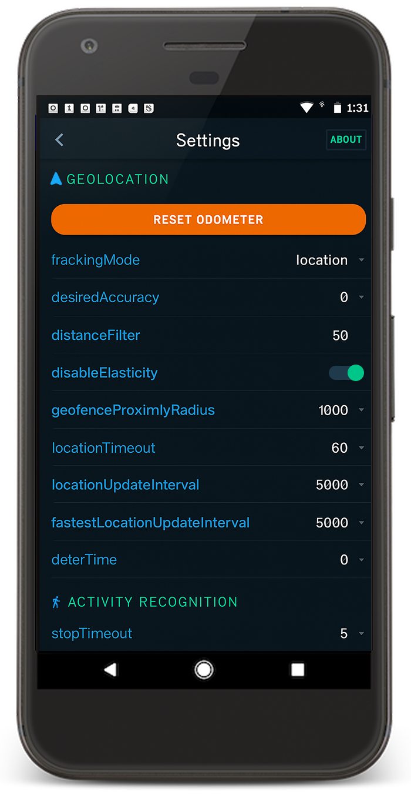

# Background Geolocation for React Native

The _most_ sophisticated background **location-tracking & geofencing** module with battery-conscious motion-detection intelligence for **iOS** and **Android**.

The plugin's [Philosophy of Operation](../../wiki/Philosophy-of-Operation) is to use **motion-detection** APIs (using accelerometer, gyroscope and magnetometer) to detect when the device is _moving_ and _stationary_.

- When the device is detected to be **moving**, the plugin will _automatically_ start recording a location according to the configured `distanceFilter` (meters).

- When the device is detected be **stationary**, the plugin will automatically turn off location-services to conserve energy.

Also available for [Flutter](https://docs.flutter.dev/), [Cordova](https://pub.dev/packages/cordova/versions), [NativeScript](https://docs.nativescript.org/) and pure native package.

---




## :large_blue_diamond: Installing the Plugin

### With _Expo_

```shell
npx expo install react-native-background-geolocation
```

### With `yarn`

```bash
yarn add react-native-background-geolocation
```

### With `npm`

```
$ npm install react-native-background-geolocation --save
```

## :large_blue_diamond: Setup Guides

### Expo

- [Expo Setup](help/INSTALL-EXPO.md)

### iOS

- [Auto-linking Setup](help/INSTALL-IOS-AUTO.md)

### Android

- [Auto-linking Setup](help/INSTALL-ANDROID-AUTO.md)

## :large_blue_diamond: Using the plugin

```javascript
import BackgroundGeolocation from "react-native-background-geolocation";
```

### [Typescript](https://facebook.github.io/react-native/blog/2018/05/07/using-typescript-with-react-native) API:

For those using [Typescript](https://facebook.github.io/react-native/blog/2018/05/07/using-typescript-with-react-native) (**recommended**), you can also `import` the interfaces:

```javascript
import BackgroundGeolocation, {
  State,
  Config,
  Location,
  LocationError,
  Geofence,
  GeofenceEvent,
  GeofencesChangeEvent,
  HeartbeatEvent,
  HttpEvent,
  MotionActivityEvent,
  MotionChangeEvent,
  ProviderChangeEvent,
  ConnectivityChangeEvent,
} from "react-native-background-geolocation";
```

## :large_blue_diamond: [Demo Application](https://github.com/SevenSquare-Tech/real-time-location-tracking-and-geofencing.git)

A fully-featured [Demo App](https://github.com/SevenSquare-Tech/real-time-location-tracking-and-geofencing) is available in its own public repo. After first cloning that repo, follow the installation instructions in the **README** there. This demo-app includes a settings-screen allowing you to quickly experiment with all the different settings available for each platform.


## :large_blue_diamond: [Simple Testing Server](https://github.com/SevenSquare-Tech/real-time-location-tracking-and-geofencing)

A simple Node-based [web-application](https://github.com/SevenSquare-Tech/real-time-location-tracking-and-geofencing.git) with SQLite database is available for field-testing and performance analysis. If you're familiar with Node, you can have this server up-and-running in about **one minute**.


# Credits

[Transistor Soft](https://www.transistorsoft.com/)
